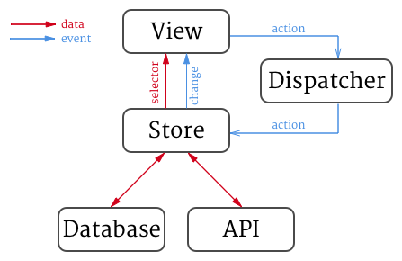

# WordPressFlux - A Flux-inspired data flow architecture

WordPressFlux provides the tools to build a data flow architecture similar to [Flux][1].

The main design goal for this is to decouple how data is acquired, how it’s modified, and who is interested in the data.

## Table of Contents

- [How it works](#how-it-works)
- [Usage](#usage)
- [Where we come from](#where-we-come-from)
- [Future ideas](#future-ideas)

## How it works



The **Store** is what holds the data and business logic about a specific domain (posts, comments, plugins,…) in the application. Only the Store is allowed to modify data in response to **Actions**. The Store always decides when to initiate a network request, either when an Action modifies the data, or based on the active **Queries**.

The **Dispatcher** is what the different components use to broadcast messages to other components. This is very similar in spirit to `(NS)NotificationCenter`, but strongly typed and written with Swift in mind. There’s a global `ActionDispatcher` that’s used by the views to send actions to stores.

A **Query** is a component that describes a subset of data that a view or other component wants from the store. The store will decide what needs to fetch from the network to satisfy the active queries.

## Usage

The first step is to define your Store subclass and its internal state. We'll use comments as an example.

```swift
// Simplified comment model
struct Comment {
    let id: Int
    let parent: Int
    let content: String
}

class CommentsStore: Store {
    // Stored comments keyed by site
    private var comments = [Int: [Comment]]()

    // Fetching state per site
    private var fetching = [Int: Bool]()
}
```

The next step is to define some selectors to get data from the store. For our comments store, we'll need to ask for a list of comments for a site, and for a specific comment.

```swift
extension CommentStore {
    func getComments(siteID: Int) -> [Comment] {
        return comments[siteID]
    }

    func getComment(id: Int, siteID: Int) -> Comment {
        return comments[siteID].first(where: { $0.id == id })
    }
}
```

Then we need to define all the actions that can be performed on comments.

```swift
enum CommentAction: Action {
    case delete(siteID: Int, id: Int)
    case reply(siteID: Int, parent: Int, content: String)
}

extension CommentStore {
    override func onDispatch(_ action: Action) {
        guard let commentAction = action as? CommentAction else {
            return
        }
        switch commentAction {
        case .delete(let siteID, let id):
            deleteComment(siteID: siteID, id: id)
        case .reply(let siteID, let parent, let content):
            replyToComment(siteID: siteID, parent: parent, content: content)
        }
    }

    func deleteComment(siteID: Int, id: Int) {
        guard let index = comments.index(where: { $0.id == id }) else {
            return
        }
        comments.remove(at: index)
        emitChange()
        CommentsApi().deleteComment(id: id, siteID: siteID)
    }

    func replyToComment(siteID: Int, parent: Int, content: String) {
        let comment = Comment(id: -1, parent: parent, content: Content)
        comments.append(comment)
        CommentsApi().postComment(comment: comment, success: {
            // Update the stored comment once we have an ID
        })
    }
}
```

Instead of having to call `emitChange()` every time you modify the state, WordPressFlux provides another class named `StatefulStore` that will do that for you, as long as you keep all the state inside a `state` variable.

```swift
struct CommentsStoreState {
        // Stored comments keyed by site
    var comments = [Int: [Comment]]()
    // Fetching state per site
    var fetching = [Int: Bool]()
}

class CommentsStore: StatefulStore<CommentsStoreState> {
    init() {
        super.init(initialState: CommentsStoreState())
    }
}
```

`StatefulStore` also provides a helper to group several state changes into the same change event. This is useful if you want to avoid notifying the store consumers of partial changes. For instance, let's implement the methods to fetch and receive comments from the API.

```swift
extension CommentsStore {
    func fetchComments(siteID: Int) {
        state.fetching[siteID] = true
        CommentsApi().getPlugins(
            siteID: siteID,
            success: { [weak self] (comments) in
                self?.receiveComments(siteID: siteID, comments: comments)
            },
            failure: { (error) in
                // Dispatch an error
        })
    }

    func receiveComments(siteID: Int, comments: [Comment]) {
        transaction { (state) in
            state.plugins[siteID] = plugins
            state.fetching[siteID] = false
        }
    }
}
```

Lastly, we need to define our queries that the View layer can use to request data. To manage queries, our store needs to inherit from `QueryStore` and implement a `queriesChanged()` method. When this method is called, the store needs to evaluate the `activeQueries` list and its `state` and decide if it needs to request any data from the network.

```swift
// If there are several types of queries, an enum is usually a
// better fit, but the struct keeps the example code simpler.
struct CommentsQuery {
    let siteID: Int
}

class CommentsStore: QueryStore<CommentsStoreState, CommentsQuery> {
    init() {
        super.init(initialState: CommentsStoreState())
    }

    override func queriesChanged() {
        // This is a very naive approach that would cause too many
        // network requests.
        // The state should consider when the data was last fetched,
        // and provide an option to override that when the user requests
        // an explicit refresh.
        activeQueries
            .map({ $0.siteID })
            .filter({ !state.fetching[$0] })
            .forEach { (siteID) in
                fetchComments(siteID: siteID)
            }
    }
}
```

The View Model or View Controller would then run the query on the store and keep the receipt:

```swift
class CommentListViewModel {
    var queryReceipt: Receipt

    init(siteID: Int, store: CommentsStore) {
        queryReceipt = store.query(CommentsQuery(siteID: siteID))
    }
}
```

These usage examples are meant to showcase the different components from WordPressFlux and are excessively simple for real usage. Some examples of things they don't deal with:

- Differentiating between “haven’t talked to the server yet” and “I asked and there was no data”.
- Error handling.
- Persistence/caching and how to integrate with Core Data.
- Avoiding requests if we have fresh enough data.

## Where we come from

Previous to this, the WordPress app handled data through `Service` classes. A `Service` class would provide all the operations relevant to a specific entity, like syncing or modifying objects. Services would be in charge of calling the appropriate `Remote` classes when they needed to talk to the network.

The instances of the Service class were meant to be short-lived, and a View Controller would instantiate one, perform a request and dispose of it. This made usage easy, but it meas there was no shared state, and nothing to prevent duplicate or conflicting requests.

The most common scenario for loading objects from the network would be:

1. A View Controller is instantiated and presented.
2. From its `viewDidLoad` method, it instantiates a `Service` and calls its `sync` method.
3. The `Service` instantiates a `Remote` and requests data from the network.
4. When the data arrives, the `Service` merges the results with the existing data in Core Data.
5. The View Controller's `NSFetchedResultsController` notices the managed objects have changed and asks the View Controller to update.

This generally works, except for some cases. `NSFetchedResultsController` works great with `UITableView`, but there's no equivalent for observing single entities. Also, there's nothing to prevent duplicate requests: every time you navigate away from a list and come back, the data is requested again.

Also, while the results controller provides updates to lists of entities, there's no good way of communicating other state changes like errors to interested parties, unless they initiated the request.

## Future ideas

There are a few things that were left out of the initial implementation. Some are due to current limitations of Swift, and others require some more real usage before we can evaluate their usefulness.

**Equatable state changes**. `StatefulStore` provides a secondary change dispatcher that will include the old and new states when calling `onStateChange(_:)`. The ideal scenario is that this would only be called if the old state and the new are actually different. This is doable if `State` conforms to `Equatable`, but implementing that can require a lot of boilerplate, and it's an optimization that we don't know if we need yet. Swift 4.1 will include [Equatable/Hashable conformance synthesis](https://github.com/apple/swift-evolution/blob/master/proposals/0185-synthesize-equatable-hashable.md) making this much easier.

**Queries with selectors**. Right now a specific `Query` is defined by the application, there's not even a protocol for it like we have for `Action`. One idea was to have a query define a `selector: (State) -> Result`. This way, a store could map any state change to query results, and notify query observers only when the result changed. This is an interesting feature, but it was problematic to implement in a generic way. The main issue was storing heterogeneous queries with different `Result` types. It's not yet ruled out as impossible, but we need to use this more and decide if the optimization is worth it.
