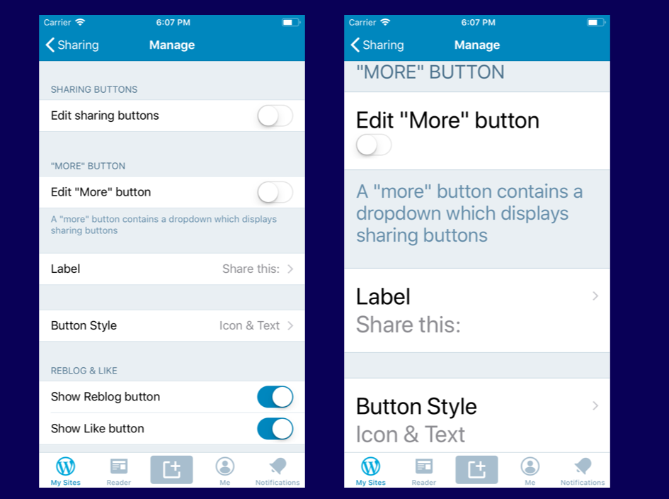

# Dynamic Type Guidelines

## Terminology:

* **Content size category**: The preferred content size for the content, selected by the user in the settings app.
* **Dynamic Font**: A font that resizes itself automatically real time when user updates the content size categories.
* **Static Font**: Adjusts itself to the content size category when it's created, but it won´t update live for changes.
* **Fixed Font**: A font with a permanent point size, independent from content size category.

### User controlled settings:

**Text size**

Available in `Settings > Display and Brightness > Text Size`

Users can select between seven text sizes (ranging from xSmall to XXXLarge). Apps that support Dynamic Type will adjust to the text size selected by users.

**Larger Text**

Can be activated in `Settings > Accessibility > Larger Text`
Provides six large text sizes in addition to the standard dynamic types. 

## Accessibility content size category

Accessibility content size category is an option that allows any user to enlarge font sizes beyond the regular setting.

Prior to iOS 11, accessibility content size category affected only the `.body` font text style, but starting with iOS 11 it affects all text styles. This affects us by (i.e.) turning titles and footnotes huge.

For horizontal layouts, it's recommended to change the layout to vertical when this accessibility content size category is being used. A good example is the UITableViewCell with the `detailTextLabel` on the right, or with an accessory view. This will align vertically for any accessibility content size category.



This is an example of how we can do this in code:
```swift
if traitCollection.preferredContentSizeCategory.isAccessibilityCategory {
    stackView.axis = .vertical
} else {
    stackViewds.axis = .horizontal
}
```


## What and when to use

In general terms, we always want to use dynamic fonts, except for very specific cases where we prefer to use fixed fonts. If we are forced to use static fonts (i.e. to get an italic) we need to update it manually.

Fixed fonts are used in system bars like Navigation Bar, Tab Bar and Search Bar, also in some non-scrollable horizontal controls like `UISegmentedControl` and `UITextField`.


## How to

### Views

The most important step is to create fonts using `preferredFontForTextStyle`.
Next is to mark `adjustsFontForContentSizeCategory = true` in the UILabel or UIButton instance.

Not all font styles can be created using `preferredFontForTextStyle`, such as a font with a specific *weight* or an *italic* font.
In this case, we will want to create a *static font* and update it manually each time the user updates the content size category.

To achieve this, we override `traitCollectionDidChange` as shown here:

```swift 
override func traitCollectionDidChange(_ previousTraitCollection: UITraitCollection?) {
// At the beginning of your implementation, call super to ensure that interface elements higher in the view hierarchy have an opportunity to adjust their layout first
	super.traitCollectionDidChange(previousTraitCollection)
	if previousTraitCollection?.preferredContentSizeCategory != traitCollection.preferredContentSizeCategory {
		preferredContentSizeDidChange()
	}
}
 
func preferredContentSizeDidChange() {
	updateFonts()
}
```

### WPStyleGuide
In general, `WPStyleGuide` and its extensions, in particular `WPStyleGuide+DynamicType` are your friends. 

`WPStyleGuide+DynamicType` provides methods to create dynamic fonts with a given text style and a maximum font size (optional). For example:

```swift
extension WPStyleGuide {
@objc public static let maxFontSize: CGFloat = 32.0
@objc public class func fontForTextStyle(_ style: UIFontTextStyle, maximumPointSize: CGFloat = maxFontSize) -> UIFont {
//…
}
``` 

Providing a maximum font size can be useful when handling some corner cases, in particular when users have activated Larger Text, like views with overlapping text content. 

#### Layout

It's important to layout all views and subviews correctly for this mechanism to work and to avoid visual issues.

* Avoid constraining the height of a `UILabel`, `UIButton`, or any view that has a `UILabel` or a `UIButton` as a child view at all cost.
* In cases where a minimum height is necessary, use a constraint relation`greaterThanOrEqualTo`.
* In most cases for `UIButton` instances, setting `.contentEdgeInsets` top and bottom will be enough to get a minimum height.
* Using `UIStackView` makes it easier to create layouts that grow automatically with dynamic type.
* If you need insets in `UIStackView`, you can try the following instead of setting height constraints:
```swift
stackView.layoutMargins = UIEdgeInsets(top: 12, left: 0, bottom: 12, right: 0)
stackView.isLayoutMarginsRelativeArrangement = true
//This can also be made in InterfaceBuilder
```
* When laying down subviews vertically, always constrain top and bottom of all views as a cascade. Only constrain height when absolutely necessary (usually just for `UIImageView`), so they can grow freely.
* Basically, `UIStackView` is your friend. Use it as much as you can.

### Table Views

Table views are special since they are made to work nicely with dynamic type. But there are still some details to be careful about.

1. Follow the self-sizing cell rules for layout and setup.
2. Use dynamic fonts.
3. Set `adjustsFontForContentSizeCategory = true` in labels and buttons.
4. Everything should be working already!

#### The static TableView case

There is an ugly bug in UIKit that makes labels disappear in static TableViews when the user changes the content size category (you can see this bug in many Apple apps). To prevent this from happening, try one of the following:

1. Treat the table as a dynamic one, setting all labels' content every time it is reloaded (even the ones that shouldn't change ever).
2. Use a dynamic table instead.


### Further reading
* [Apple’s HIG. Typography](https://developer.apple.com/ios/human-interface-guidelines/visual-design/typography/)
* [Building Apps with Dynamic Type - WWDC 2017](https://developer.apple.com/videos/play/wwdc2017/245/)
* [Supporting dynamic type](https://useyourloaf.com/blog/supporting-dynamic-type/)
* [Using a custom font with dynamic type](https://useyourloaf.com/blog/using-a-custom-font-with-dynamic-type/)