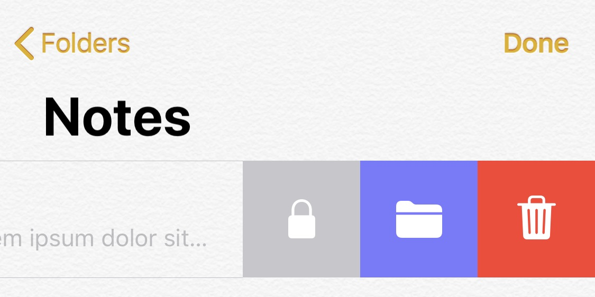

# Using VoiceOver

## Prepare for VoiceOver

You can set up an easy shortcut to access VoiceOver from anywhere. 

Go to iOS Settings → General → Accessibility → Accessibility Shortcut. Then select VoiceOver. 

Now, you can triple-click the side button (on iPhone X series) or the home button (on devices with home button) to turn on and off VoiceOver.

## Using VoiceOver

### Basics

When VoiceOver is ON, the system will highlight and read an accessibility element on the screen. It could be a Button, Label, whole View, etc…

Slide with one finger across the screen until you find the element you want to activate. The OS will read every element that your finger touches. When you find the element you want to activate, double-tap with one finger anywhere on the screen to perform that action. If it‘s a button, it will be pressed, if it‘s a switch, it will be flipped, etc…

### Scrolling and Pull-to-Refresh

If you need to scroll a table, you need to select any element inside that table and swipe up or down with three fingers.

To pull-to-refresh a table, navigate to the top of the table and swipe down with three fingers.

### Navigating Back

If you want to close a window or go back from wherever you were in an app, you can draw a Z with two fingers. This is especially helpful for modal views with no easy way to be closed.

### App Switcher and Home Screen (iPhone X family)

For the iPhone X family, the swipe from the bottom of the screen gesture is different. When you start dragging, you will hear a  tone, then you need to continue dragging until you hear another tone. The speed is not important, it can be slow. The behavior depends on how many tones you've heard:

- Two tones will close the app and show the Home Screen.
- Three tones will show the App Switcher.

### Table Cell Actions

To access table cell actions like Delete, select a cell, and swipe up or down. VoiceOver will rotate and speak the available actions. After picking the action that you want, double-tap to activate it.

### Stopping VoiceOver

You can stop VoiceOver any time by triple-clicking the side/home button again and unchecking VoiceOver.

## Further Reading

- [Learn VoiceOver gestures on iPhone](https://support.apple.com/en-ca/guide/iphone/iph3e2e2281/ios)
- [Control VoiceOver using the rotor on iPhone](https://support.apple.com/en-ca/guide/iphone/iph3e2e3a6d/13.0/ios/13.0)
- [iOS VoiceOver Cheat Sheet (PDF)](https://interactiveaccessibility.com/education/training/downloads/iOS-Cheatsheet.pdf)