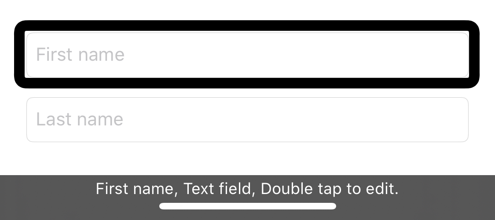
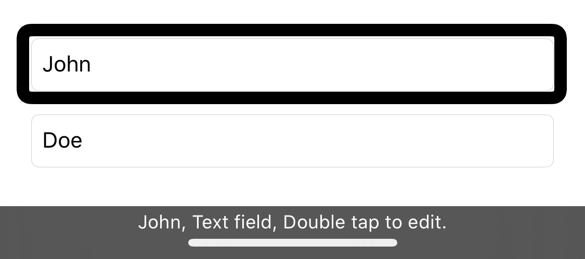
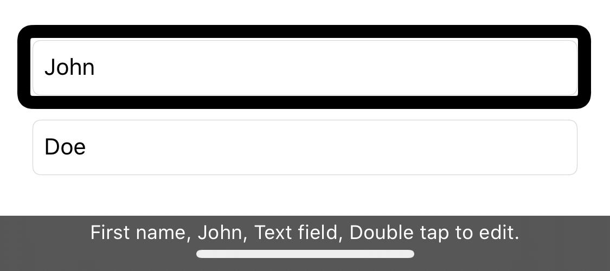
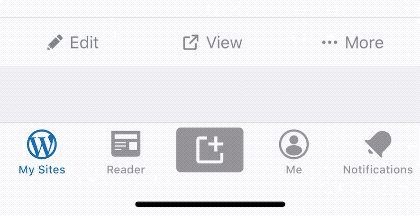
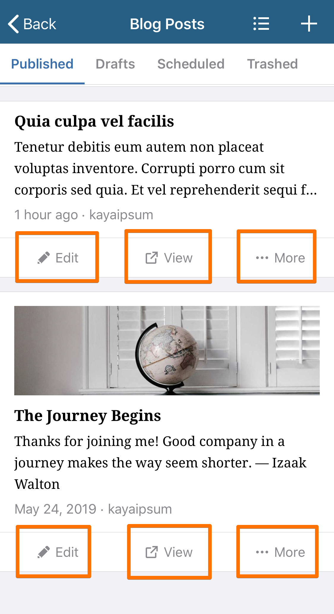
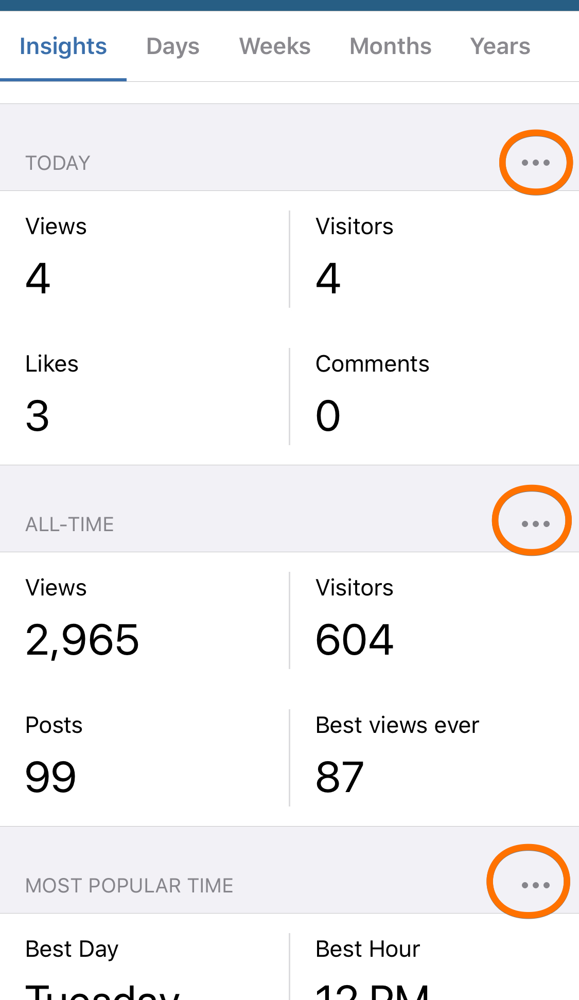
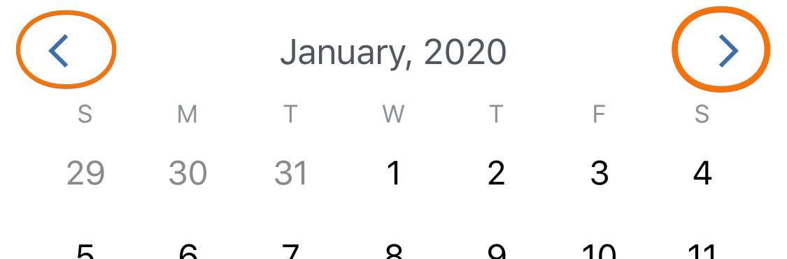
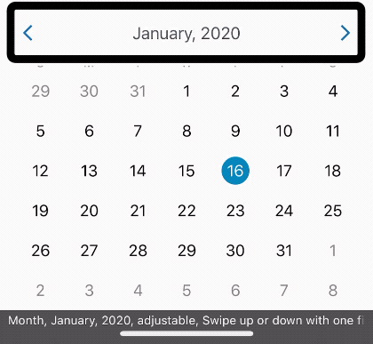

# VoiceOver Guidelines

If you haven't worked with VoiceOver before, we recommend going through the [Using VoiceOver](using-voiceover.md) guide first.

#### Table of Contents

- [Guidelines](#guidelines)
	- [Basics](#basics)
    - [Always add Labels to Text Fields](#textfield-labels)
    - [Grouping Elements](#grouping-elements)
    - [Navigation Order](#navigation-order)
    - [Appearing and Disappearing Elements](#appearing-disappearing)
    - [Prefer Disabling Instead of Hiding Elements](#prefer-disabling)
    - [Use Static Labels for Toggle Buttons](#toggle-buttons)
    - [Consider Using Custom Actions to Simplify Navigation](#custom-actions)
    - [Provide Sufficient Context in Labels of Repeating Elements](#repeating-elements-labels)
    - [Support Escape Gesture for Custom Modal Views](#escape-gesture)
    - [Consider Using Adjustables to Consolidate Related Buttons](#increment-decrement)
- [Auditing](#auditing)
    - [Questions to ask](#questions-to-ask)
    - [Manual Audit](#audit-manual)
    - [Automated Audit](#audit-automated)
- [Further Reading](#further-reading)

## <a name="guidelines"></a>Guidelines

### <a name="basics"></a>Basics

Providing support for VoiceOver is quite straightforward. For most cases, providing only three attributes should be enough:

* [`accessibilityLabel`](https://developer.apple.com/documentation/objectivec/nsobject/1615181-accessibilitylabel): A short, localized word or phrase that succinctly describes the control or view, but does not identify the element’s type.
* [`accessibilityTraits`](https://developer.apple.com/documentation/objectivec/nsobject/1615202-accessibilitytraits): A combination of one or more individual traits, each of which describes a single aspect of an element’s state, behavior, or usage
* [`accessibilityHint`](https://developer.apple.com/documentation/objectivec/nsobject/1615093-accessibilityhint): A brief, localized phrase that describes the results of an action on an element

As an example, for a Share button, the recommended attributes would be:

```swift
button.accessibilityLabel = "Share"
button.accessibilityTraits = .button
button.accessibilityHint = "Opens the sharing sheet."
```

However, it is important to provide [helpful and accurate attributes](https://developer.apple.com/library/content/documentation/UserExperience/Conceptual/iPhoneAccessibility/Making_Application_Accessible/Making_Application_Accessible.html#//apple_ref/doc/uid/TP40008785-CH102-SW6). The strings used for the attributes should also be [localized](https://developer.apple.com/library/archive/documentation/MacOSX/Conceptual/BPInternational/InternationalizingYourCode/InternationalizingYourCode.html#//apple_ref/doc/uid/10000171i-CH4-SW1).

#### <a namme="labels"></a>Labels

For a regular control or view, Apple recommends that labels should:

- Describe the element briefly.
- Not include the type of control or view.
- Begin with a capitalized word.
- Not end with a period.
- Be localized.

Beginning with a capitalized word and not ending with a period helps VoiceOver read the label with the appropriate inflection.

#### <a name="traits"></a>Traits

The traits attribute contains one or more individual traits that, taken together, describe the behavior of an accessible user interface element. Because some individual traits can be combined to describe a single element, the element’s behavior can be precisely characterized.

Here are some guidelines for using [accessibility traits](https://developer.apple.com/documentation/uikit/accessibility/uiaccessibility/accessibility_traits).

- Use [`.link`](https://developer.apple.com/documentation/uikit/uiaccessibility/uiaccessibilitytraits/1620178-link) instead of `.button` if a button will show the Safari app. A transition to a separate app may not be immediately obvious to a VoiceOver user. VoiceOver speaking `“link”` instead of `“button”` helps with this.
- Take advantage of opportunities to use [`.header`](https://developer.apple.com/documentation/uikit/uiaccessibility/uiaccessibilitytraits/1620170-header). Using the [rotor](https://support.apple.com/en-ca/guide/iphone/iph3e2e3a6d/13.0/ios/13.0), VoiceOver users can opt to _navigate by headers_. The presence of the `.header` trait helps the user understand the structure of the screen.

#### <a name="hints"></a>Hints

Apple recommends that hints should:

- Briefly describe the results. What is going to happen after interacting with this control or view?
- Begin with a verb and ignore the subject.
- Begin with a capitalized word.
- End with a period.
- Do not include the name or the type of control or view.
- Be localized.

### <a name="textfield-labels"></a>Always add Labels to Text Fields

By default, text fields _with placeholders_ provide sufficient accessibility. VoiceOver will read the placeholder and describe that it is a text field.

In the following example, VoiceOver will speak `“First name, Text field, ...”` for the First name field, and a similar message for the Last name field.



However, a problem shows up if you enter `“John”` as the first name, and `“Doe”` as the last name. 



VoiceOver will no longer read the `“First name”` and `“Last name”` placeholders. How will a user, especially someone with short-term memory, know which field is which? 

You can improve the experience by making sure that the text fields have accessibility labels.

```swift
firstNameTextField.accessibilityLabel = "First name"
lastNameTextField.accessibilityLabel = "Last name"
```



With this, VoiceOver will read the label (e.g. `"First name"`) and the value (e.g. `“John"`).

### <a name="grouping-elements"></a>Grouping Elements

If a group of elements represents a single unit of information, consider grouping them into one accessibility element. This helps reduce clutter and makes your app easier to understand and navigate. 

Take the following custom `UITableViewCell` as an example. It has at least five accessible elements. 


Since there are potentially more cells like this in the table, it would be very easy for a VoiceOver user to lose context. To improve this, you can:

- Group the elements by concatenating the information in the `UITableViewCell`'s `accessibilityLabel`.
- And make the child elements inaccessible by setting their `isAccessibilityElement` to `false`.

```swift
class CustomCell: UITableViewCell {
    override var accessibilityLabel: String? {
        get {
            let format = "Post by %@, from %@. %@. %@. %@. Excerpt. %@."
            return String(format: format,
                          author,
                          blogName,
                          datePublished,
                          isFollowing ? "Following" : "",
                          title,
                          excerpt)
        }
        set { }
    }
}
```

When the cell is focused, VoiceOver would then speak something like this:

```
Post by Carolyn Wells, from Discover. 6 days ago. Following. 
Around the World with WordPress: Jamaica. 
Excerpt. Today, we’re highlighting five sites from the island paradise of Jamaica.
```

- Prefer to place the most important elements first. The VoiceOver user can prefer to skip if they've already listened to what they need. This is why we placed the `excerpt` last in the example.
- Don't forget the periods when concatenating. They make VoiceOver pause, which helps prevent incomprehension.
- The `"Excerpt".` static text in the example is used as a separator and _signals_ that a very long text will be read by VoiceOver.

### <a name="navigation-order"></a>Navigation Order

VoiceOver may not navigate views in the order that you'd naturally expect. For example, this `UITableViewCell` has nested stack views where:

- The vertical stack view is the parent, and multiple horizontal stack views are children. 
- Two labels are contained inside of each horizontal stack view. One for the title (e.g. Subtotal) and one for the value (e.g. $999.99).


You would expect VoiceOver to navigate the elements in this order:

1. `“Subtotal”`
2. `“$999.99”`
3. `“Discount”`
4. `“-$601.00”`
5. `“Shipping”`
6. `“$0.01”`
7. `“Taxes”`
8. `“$333.33”`

In this case, however, VoiceOver defaults to navigating to the first item in each horizontal stack view, followed by the second.

1. `“Subtotal”`
2. `“Discount”`
3. `“Shipping”`
4. `“Taxes”`
5. `“$999.99”`
6. `“-$601.00”`
7. `“$0.01”`
8. `“$333.33”`

This makes the information difficult to comprehend. To fix this, use [`accessibilityElements`](https://developer.apple.com/documentation/objectivec/nsobject/1615147-accessibilityelements) on the parent view to list the desired navigation order of the subviews.

```swift
contentView.accessibilityElements = [subtotalTitleLabel, 
			             subtotalValueLabel, 
			             discountTitleLabel, 
			             discountValueLabel,
			             shippingTitleLabel,
			             shippingValueLabel,
			             taxesTitleLabel,
			             taxesValueLabel]
``` 

The `accessibilityElements` can be used for all types of elements, including but not limited to, buttons and images view. You can also use `accessibilityElements` to make an element inaccessible by not including it in the list.

### <a name="appearing-disappearing"></a>Appearing and Disappearing Elements

If you have a UI element that is shown after an event happens, consider notifying VoiceOver that a new UI element is visible on the screen. 

An example of this is a custom Snackbar.



A blind user may never discover that a Snackbar was shown on the screen unless they accidentally moved their finger over it. To make the user aware of it, you can send a notification to VoiceOver using [`UIAccessibility.post`](https://developer.apple.com/documentation/uikit/uiaccessibility/1615194-post) with [`.layoutChanged`](https://developer.apple.com/documentation/uikit/uiaccessibility/notification/1620186-layoutchanged).

```swift
let snackBarView = createSnackBarView()
presentSnackBar(snackBarView)

UIAccessibility.post(notification: .layoutChanged, argument: snackBarView)
```

This notifies VoiceOver that a new view, `snackBarView`, has appeared and it should move the _focus_ to it. VoiceOver will then read its derived `accessibilityLabel`.

Once the element disappears, you should send another notification but with a `nil` argument. This makes VoiceOver immediately move the focus to a different element on the screen.

```swift
UIAccessibility.post(notification: .layoutChanged, argument: nil)
```

### <a name="prefer-disabling"></a>Prefer Disabling Instead of Hiding Elements

A common UI pattern is hiding elements (e.g. buttons) until users can use them. 


This is not ideal for vision accessibility. VoiceOver users, especially first-time users, may try to understand how to interact with your UI by navigating through all the elements on the screen. If an important button, such as the **Insert button** example above, is initially hidden, they may never discover it. This can make comprehension difficult.

Consider making the element visible, but disabled, instead. 

```swift
func viewDidLoad() {
    // Allow VoiceOver users to discover the Insert button. But don't let them use it yet.
    insertButton.isEnabled = false
}

func onImageSelected() {
    // Enable the Insert button when an image was selected.
    insertButton.isEnabled = true
}
```

If a `UIControl`'s `isEnabled` property is set to `false`, UIKit would, by default, automatically add the [`.notEnabled` accessibility trait](https://developer.apple.com/documentation/uikit/uiaccessibility/uiaccessibilitytraits/1620208-notenabled). This makes VoiceOver read the button as `“dimmed”`, which sufficiently informs the user that the `UIControl` is present but cannot be used yet.

### <a name="toggle-buttons"></a>Use Static Labels for Toggle Buttons

In general, avoid changing the `accessibilityLabel` of elements after it's already been set. If an element's `accessibilityLabel` changes over time, users may think that it is **a different element**. This can be confusing, especially if the element is at the same position on the screen.

Consider updating the [`accessibilityValue`](https://developer.apple.com/documentation/objectivec/nsobject/1615117-accessibilityvalue) instead. The `accessibilityValue` is read by VoiceOver right after the `accessibilityLabel`. This informs the user that the element is the same but it has a different state. 


```swift
func viewDidLoad() {
    listStyleToggleButton.accessibilityLabel = "List Style"
    showExpandedView()
}

func showExpandedView() {
    listStyleToggleButton.accessibilityValue = "Expanded"
}

func showCompactView() {
    listStyleToggleButton.accessibilityValue = "Compact"
}
```

The `accessibilityValue` should be set to the current state of the element. You might also want to update the [`accessibilityHint`](https://developer.apple.com/documentation/objectivec/nsobject/1615093-accessibilityhint) if the activation behavior is not obvious.

### <a name="custom-actions"></a>Consider Using Custom Actions to Simplify Navigation

If you have a view containing a few buttons, you can simplify your app's navigation and improve the experience by using [custom actions](https://developer.apple.com/documentation/uikit/uiaccessibilitycustomaction). This is especially useful for table view cells where the buttons can become repetitive.

Let's take a blog post's `UITableViewCell` as an example. It has three buttons, Edit, View, and More. And since it's a cell, it can be repeated multiple times in the table. 



We can make the buttons accessible individually. But that would increase the number of elements that the user has to navigate to. Using custom actions, we can decrease the accessible elements, simplifying the app, and still allow the user to perform the buttons' actions.

```swift
class PostCell: UITableViewCell {
    override var accessibilityCustomActions: [UIAccessibilityCustomAction]? {
        get {
            let editAction = UIAccessibilityCustomAction(name: "Edit",
                target: self, selector: #selector(showEditor))
            let viewAction = // ...
            let moreAction = // ...

            return [editAction, viewAction, moreAction]
        }
        set { }
    }

    @objc private func showEditor() -> Bool {
        // Return true if the method was successful. Returning false will 
        // trigger a different VoiceOver sound.
        return true
    }
}
```

### <a name="repeating-elements-labels"></a>Provide Sufficient Context in Labels of Repeating Elements

Repeating elements, like buttons inside table view cells, with the same `accessibilityLabel`, adds some overhead to users. When focusing on one, a user would have to identify for which item the button is.

Consider the following table with at least three _Insight_ cells. The cells have buttons on the right whose `accessibilityLabel` values are all the same, `"Manage Insight"`. 



You might want to consider making the `accessibilityLabel` of these buttons to be more specific but still succinct. 

```swift
todayInsightCell.manageButton.accessibilityLabel = "Manage Today Insight"
allTimeInsightCell.manageButton.accessibilityLabel = "Manage All-Time Insight"
mostPopularInsightCell.manageButton.accessibilityLabel = "Manage Most Popular Insight"
```

With this, a user focusing a `manageButton` would have enough context. They wouldn't need to go navigate back to the cell's title to deduce the context themselves.

### <a name="escape-gesture"></a>Support Escape Gesture for Custom Modal Views


VoiceOver has a standard escape gesture that dismisses an alert or returns to the previous screen. You can perform the gesture by moving two fingers back and forth three times quickly, making a “z”. 

This is generally supported by all the UIKit components. If you make custom (modal) views, however, VoiceOver may not know how to dismiss it. This can potentially lock your user within that view forever.

You can support the gesture by overriding [`accessibilityPerformEscape`](https://developer.apple.com/documentation/objectivec/nsobject/1615091-accessibilityperformescape) in your custom `UIView` or `UIViewController`. 

```swift 
class MyModalView: UIView {
    override func accessibilityPerformEscape() -> Bool {
        dismissView()
        return true
    }
}
```

### <a name="increment-decrement"></a>Consider Using Adjustables to Consolidate Related Buttons

If you have buttons that operate on a single source, such as Previous and Next buttons, you can opt to group them into a single [adjustable element](https://developer.apple.com/documentation/uikit/uiaccessibility/uiaccessibilitytraits/1620177-adjustable).

Let's take a calendar's month navigation as an example. To allow navigation between months, we expose a Previous and a Next button. 



If we consider that there will be more accessible buttons on the screen like the individual days, the two buttons will just add to the clutter. We can improve this by making the parent view an adjustable element and use [`accessibilityIncrement`](https://developer.apple.com/documentation/objectivec/nsobject/1615076-accessibilityincrement) and [`accessibilityDecrement`](https://developer.apple.com/documentation/objectivec/nsobject/1615169-accessibilitydecrement) for navigation.

```swift
class MonthNavigationView: UIView {
    // Make the parent accessible. This will make the subviews 
    // (i.e. the Previous and Next buttons) inaccessible.
    override var isAccessibilityElement: Bool {
        get { true }
        set { }
    }

    // Change to an adjustable. VoiceOver will inform the user that they can 
    // swipe up or down while the element is focused to change the value.
    override var accessibilityTraits: UIAccessibilityTraits {
        get { .adjustable }
        set { }
    }

    override var accessibilityLabel: String? {
        get { "Month" }
        set { }
    }

    override var accessibilityValue: String? {
        get { "RETURN_THE_CURRENT_MONTH_AND_YEAR_VALUE_HERE" }
        set { }
    }

    // Called when the user swipes up while this element is focused.
    override func accessibilityIncrement() {
        moveToNextMonth()
    }

    // Called when the user swipes down while this element is focused.
    override func accessibilityDecrement() {
        moveToPreviousMonth()
    }
}
```



With this change, users can change the month by just swiping up or down. We eliminated the need to navigate between the buttons, saving a few taps.

## <a name="auditing"></a>Auditing

There are many ways to audit your app for VoiceOver. The following is just something to help get you started. 

### <a name="questions-to-ask"></a>Questions to ask

As you perform an audit, you can keep these questions in mind.

- Is the navigation order what you expect? 
- Are there elements on the screen that were not accessed? 
- Are there accessible elements that do not make sense to be accessible?
- Are there too many accessible elements? 
- Did VoiceOver speak the appropriate trait? For example, `"Button"` or `"Heading"`.
- Is there something in the [guidelines](#guidelines) that I could use to improve the experience?
- Can you leave the current screen using the escape gesture (make a Z with 2 fingers)?
- Are the labels and hints localized?

### <a name="audit-manual"></a>Manual Audit

- Enable the **Caption Panel** in iOS Settings → Accessibility → VoiceOver. When enabled, anything that VoiceOver speaks will be displayed at the bottom of the screen. This helps with double-checking what you heard.
- Navigate to the first element and start moving to the next elements by swiping right. 
- Swipe up with two fingers to make VoiceOver speak the entire screen from the top. 
- Set the [rotor](https://support.apple.com/en-ca/guide/iphone/iph3e2e3a6d/ios) to navigate by Headings. Swipe up and down to go through all the page headings.
- Use [Screen Curtain](https://support.apple.com/en-us/HT201443) to turn the screen off. This forces you to navigate your app without being able to see anything.

### <a name="audit-automated"></a>Automated Audit

The Accessibility Inspector can run an automated accessibility audit. It is a great tool to use especially if you're just starting with accessibility. [This WWDC video](https://developer.apple.com/videos/play/wwdc2019/257/) gives a great introduction about it.

The automated audit does not cover everything in the [guidelines](#guidelines). We recommend that you use the Accessibility Inspector to complement your auditing practice.

## <a name="further-reading"></a>Further Reading

- Apple Docs 
    - [Accessibility Programming Guide for iOS](https://developer.apple.com/library/archive/documentation/UserExperience/Conceptual/iPhoneAccessibility/Introduction/Introduction.html)
    - [View Controller Programming Guide for iOS: Supporting Accessibility](https://developer.apple.com/library/archive/featuredarticles/ViewControllerPGforiPhoneOS/SupportingAccessibility.html#//apple_ref/doc/uid/TP40007457-CH12-SW1)
    - [Supporting VoiceOver in Your App](https://developer.apple.com/documentation/uikit/accessibility/supporting_voiceover_in_your_app)
- WWDC Videos
    - [Writing Great Accessibility Labels - WWDC 2019](https://developer.apple.com/videos/play/wwdc2019/254/)
    - [Deliver an Exceptional Accessibility Experience - WWDC 2018](https://developer.apple.com/videos/play/wwdc2018/230/)
    - [Making Apps More Accessible With Custom Actions - WWDC 2019](https://developer.apple.com/videos/play/wwdc2019/250/)
    - [Accessibility Inspector - WWDC 2019](https://developer.apple.com/videos/play/wwdc2019/257/)
    - [What's New in Accessibility - WWDC 2017](https://developer.apple.com/videos/play/wwdc2017/215/)
- [What iOS Traits Actually Do](https://www.deque.com/blog/ios-traits/) by Deque
- [iOS Developer Accessibility Guidelines](https://a11y-guidelines.orange.com/mobile_EN/dev-ios.html) by Orange.
- [Common Accessibility Element Pitfalls and How to Avoid Them](https://www.deque.com/blog/ios-nested-accessibility/) by Deque
- [Placeholders in Form Fields Are Harmful](https://www.nngroup.com/articles/form-design-placeholders/)