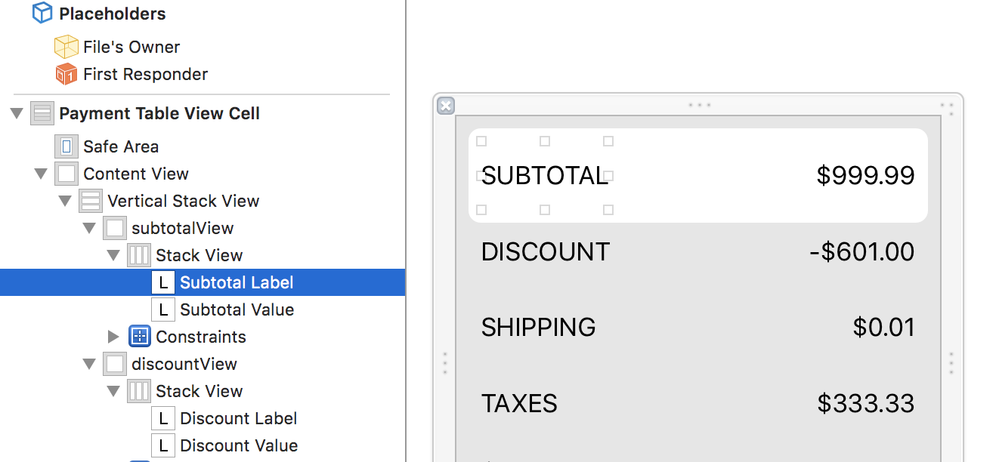

# VoiceOver Guidelines

Providing support for VoiceOver is quite straightforward. For most  cases, providing only three attributes should be enough:

* **Label:** A short, localized word or phrase that succinctly describes the control or view, but does not identify the element’s type.
* **Traits:** A combination of one or more individual traits, each of which describes a single aspect of an element’s state, behavior, or usage
* **Hint:** A brief, localized phrase that describes the results of an action on an element

As an example, for a Share button, the recommended attributes would be along the lines of: 
- Label: “Share”
- Traits: UIAccessibilityTraitButton
- Hint: “Opens the sharing sheet.”

However, it is important to provide [helpful and accurate attributes](https://developer.apple.com/library/content/documentation/UserExperience/Conceptual/iPhoneAccessibility/Making_Application_Accessible/Making_Application_Accessible.html#//apple_ref/doc/uid/TP40008785-CH102-SW6)

For a regular control or view, Apple recommends that labels should:
- Describe the element briefly
- Not include the type of control or view
- Begin with a capitalized word
- Not end with a period.
- Be localized.

Beginning with a capitalized word and not ending with a period helps VoiceOver read the label with the appropiate inflection.

The traits attribute contains one or more individual traits that, taken together, describe the behavior of an accessible user interface element. Because some individual traits can be combined to describe a single element, the element’s behavior can be precisely characterized.

Hints should:
- Briefly describe the results. What is going to happen after interacting with this control or view?
- Begin with a verb and ignore the subject
- Begin with a capitalized word
- End with a period.
- Do not include the name or the type of control or view.
- Be localized.

## When to, and when not to

UIKit does a good job adapting the default UIView elements to VoiceOver automatically,  but there are cases where it's necessary to do it manually:

### Complex views that represent one unit of information
A good example here is a custom `UITableViewCell`. A single cell usually represents just one unit of information. When they are complex enough with many labels, images, buttons, etc... a VoiceOver user can easily get lost in a forest of separate UI elements, where the grouping of information is given by the visual boundaries of the cell itself. 

To avoid that problem, the cell needs to become a VoiceOver element itself, with a label that tells the story that is displayed in the cell. A good example is the Reader cell, where its content is read by VoiceOver as follows:
```
Post by {author}, from {blog}, {time}.
{post_title}
{post_short_description}
```
This pulls together the most important information from different UILabels into a single well-structured description.

### Setting the spoken order in a complex view
Some column-based data is contained inside of stack views. VoiceOver may not speak the data in the desired order. For example, this tableview cell has nested stack views. The vertical stack view is the parent and multiple horizontal stack views are children. Two labels are contained inside of each horizontal stack view, one with the title for the data (Subtotal) and one for the data value ($999.99).



The reading order is expected to be spoken as, "Subtotal: nine hundred ninety-nine dollars and ninety nine cents". In this case, VoiceOver defaults to reading the first item in each horizontal stack view, followed by the second. The default order speaks a list of titles: "Subtotal - Discount - Shipping - Taxes" and so on, followed by the values: "$999.99, -$601.00, $0.01, $333.33", making the information difficult to comprehend.

Use `.accessibilityElements` on the parent view to list the desired reading order of the subviews.
```
contentView.accessibilityElements = [subtotalTitleLabel, 
			             subtotalValueLabel, 
			             discountTitleLabel, 
			             discountValueLabel,
			             shippingTitleLabel,
			             shippingValueLabel,
			             taxesTitleLabel,
			             taxesValueLabel]
``` 
In addition to labels, this also works for buttons, images, and views.

### Controls with not enough information
Sometimes buttons, labels, or other views are just showing an image, a number or a symbol. With this information only, UIKit can't provide a good label to be read by VoiceOver. In this cases it is our job to let UIKit know what is the meaning of that image/number/symbol, so it can be communicated to the VoiceOver user appropriately.